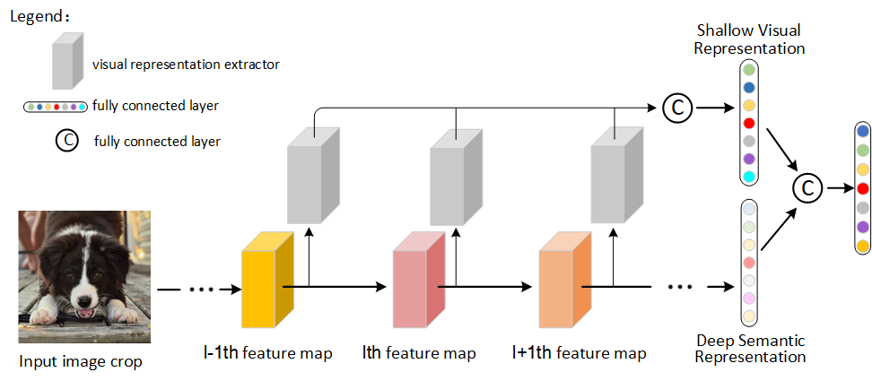

# Learning Multi-level Representations for Affective Image Recognition

The MXNet implementation of "Learning Multi-level Representations for Affective Image Recognition"

## Structure

The overall architecture. The framework of the proposed method, as shown in Figure, contains two branches: the backbone  extracts high-level semantic representations, and the shallow branches pull visual features and image aesthetics. Finally, different levels of deep representations are integrated through a fusion layer for classification.

## Requirements

You may need to install the package via pip:

* **CUDA = 10.1**
* **Python3**
* **MXNet = 1.5.1**
* **d2lzh**

## Results

Classification performance achieved on **FI dataset**.

| Model              |    FI     |
| ------------------ | :-------: |
| AlexNet            |   72.43   |
| VGGNet             |   83.05   |
| ResNet-50          |   85.06   |
| PCNN (VGGNet) [42] |   75.34   |
| DeepSentiBank [54] |   61.54   |
| AR [52]            |   86.35   |
| L_{cil}            | **87.87** |

## Visualization

Visualization of convolution filters, which produce an activation map with the highest activation, in several convolutional layer. The images from left to right and top to bottom are the input image, the representations in the 1th, 2th, 3th and 4th convolutional blocks, respectively.

## Citation

>  @article{Zhang2022, 
&nbsp; &nbsp; &nbsp; &nbsp; author = {Zhang, Hao and Xu, Dan and Luo, Gaifang and He, Kangjian}, 
&nbsp; &nbsp; &nbsp; &nbsp; doi = {10.1007/s00521-022-07139-y}, 
&nbsp; &nbsp; &nbsp; &nbsp; issn = {0941-0643}, 
&nbsp; &nbsp; &nbsp; &nbsp; journal = {Neural Computing and Applications}, 
&nbsp; &nbsp; &nbsp; &nbsp; publisher = {Springer London}, 
&nbsp; &nbsp; &nbsp; &nbsp; title = {{Learning multi-level representations for affective image recognition}}, 
&nbsp; &nbsp; &nbsp; &nbsp; url = {https://doi.org/10.1007/s00521-022-07139-y}, 
&nbsp; &nbsp; &nbsp; &nbsp; volume = {0123456789}, 
&nbsp; &nbsp; &nbsp; &nbsp; year = {2022}}

